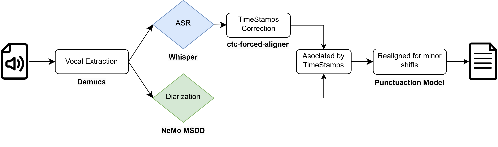

# lnco-transcribe: A CLI Tool for Automated Audio Transcription & Diarization

A lightweight Python package for converting audio interviews into structured text with speaker diarization.

- This repository is a standalone packaged version of the [Automatic Interviews Processing project](https://github.com/AfroDeivid/automatic-interviews-processing).

The original project covers a complete workflow with audio-to-text, transcript processing & evaluation, text analysis and topic modeling. However, this repository focuses exclusively on packaging the **Audio-to-Text (transcription and diarization)** module into a lightweight, installable CLI tool for easy deployment via PyPI.

Developed by [David Friou](https://github.com/AfroDeivid) as part of a semester project at [LNCO Lab](https://www.epfl.ch/labs/lnco/).



## Table of Contents
1. [Installation](#installation)  
   1. [Prerequisites](#1-prerequisites)  
   2. [Installing Required Packages](#2-installing-required-packages)  
2. [Usage](#usage)  
   1. [Preparing Your Data](#preparing-your-data)  
   2. [Transcription & Diarization (Audio-to-Text)](#transcription--diarization-audio-to-text)  
   3. [Outputs](#outputs)  
3. [File Structure](#file-structure)  
   1. [Audio-to-Text Processing](#audio-to-text-processing)  
   2. [Transcript Evaluation](#transcript-evaluation)  
   3. [Text and Topic Analysis](#text-and-topic-analysis) 
4. [Mentions](#mentions)

# Installation

## 1. Prerequisites
Essential tools and libraries that need to be installed before proceeding with the main package installations.

- Install ``FFMPEG`` from [here](https://ffmpeg.org/download.html), you can follow a guide like [this](https://phoenixnap.com/kb/ffmpeg-windows) for Windows installation.  
Ensure that FFMPEG is added to your system’s PATH.

- Install ``Strawberry Perl`` from [here](https://strawberryperl.com/).

- ``Visual C++ Build Tools``: If you encounter build errors during installation, install the Visual C++ Build Tools by following this [guide](https://stackoverflow.com/questions/40504552/how-to-install-visual-c-build-tools) or download directly from [Visual C++ Build Tools](https://visualstudio.microsoft.com/visual-cpp-build-tools/).


## 2. Installing Required Packages

After ensuring the prerequisites are set up, you can proceed with creating the folowing environement :

**Locked Environment Installation**  
This setup recreates the *exact environment* used during my semester project:
```
conda create --name tti python=3.10 --yes
conda activate tti
pip install cython
pip install -r freeze_requirements.txt
python -m spacy download en_core_web_sm
``` 

**Flexible / Adaptive Installation**  
If you need more flexibility, like updating certain packages or adapting the repository replace the ``pip install -r freeze_requirements.txt`` step with:
```
pip install -c constraints.txt -r requirements.txt 
``` 

# Usage

## Preparing Your Data

The pipeline supports nested folder structures, making it easy to process multiple experiments and interviews. To use the pipeline:

- Simply indicate the path to your folder with your audio files.
- The pipeline recursively processes all audio files within these folder and subfolders.

## Transcription & Diarization (Audio-to-Text)
Use the [run_diarize.py](src/run_diarize.py) script to transcribe and diarize audio:

- **Transcribe the audio in his original language :** *(specified with --language)* 
```bash
python run_diarize.py -d path_to_folder --whisper-model large-v3 --language en
```

- **Transcribe and translate the audio to english :** *(e.g. from french to english)*
```bash
python run_diarize.py -d path_to_folder --whisper-model large-v3 --language fr --task translate
```

If only ``language`` is specified, the model will attempt to translate any detected language into the specified language.

To improve performance, specify the task as ``translate`` if you know in advance that the audio is in a certain language (e.g., French) and want to translate it into English.

- You can view the list of all supported languages along with their corresponding language codes just here: [Languages](src/whisper_diarization/helpers.py)

| Parameter         | Description                                         | Default                         |
|-------------------|-----------------------------------------------------|---------------------------------|
| **`-d, --directory`** | Path to the directory containing audio files.       | None                 |
| **`--whisper_model`** | Name of the Whisper model used for transcription.   | None                      |
| **``--language ``**       | Language code for transcription (e.g., `fra` for French, `eng` for English). | None                            |
| **``--task ``**           | Task to perform (e.g., "transcribe", "translate").  | None                            |
| **``-e, --extensions``**      | List of allowed audio file extensions.              | [".m4a", ".mp4", ".wav"]        |
| **``--overwrite``**       | Overwrites existing transcriptions if specified.    | False                           |

*See [run_diarize.py](src/run_diarize.py) for additional information.*

## Outputs
- **Text Format:** Simplified and easy-to-read files for manual review.
- **CSV Format:** A structured format ideal for analysis, with columns such as:
  - Experiment name (derived from the name of the folder directory).
  - File name.
  - Participant ID.
  - Timestamps for each segment.
  - Speaker roles and transcription content.

### Processed folder
Contains the same outpouts after aditional preprocessing steps:

- Removal of vocalized fillers
- Visual cleaning of the text
- Prediction of the speaker role in interview set-up (Participant & Interviewer)

For a more modular approach you can use [preprocessing notebook](./src/preprocessing.ipynb).

# File Structure

## Audio-to-Text Processing  
This section focuses on converting raw audio data into text through transcription and diarization, enabling subsequent analysis.  

- **Preprocessing and Conversion:**  
  - [src/pre_analysis.ipynb](./src/pre_analysis.ipynb): Analyzes audio files and experiment structure.  
  - [MTS_to_audio.py](src/MTS_to_audio.py): Converts `.MTS` videos into `.wav` format for processing.  

- **Transcription & Diarization:**  
  - [run_diarize.py](src/run_diarize.py): The main script for batch-processing transcription and speaker diarization.  
  - [/src/whisper_diarization](./src/whisper_diarization/): Source code from the Whisper-Diarization framework. (See [Mentions](#mentions))  
  - [nemo_msdd_configs/](./nemo_msdd_configs/): YAML configuration files for diarization tasks.  

- **Transcript Preprocessing:**  
  - [src/preprocessing.ipynb](./src/preprocessing.ipynb): Modular workflow for cleaning and preparing transcripts for further analysis.  

``/src/utils/`` [format_helpers.py](./src/utils/format_helpers.py) and [preprocessing_helpers.py](./src/utils/preprocessing_helpers.py): Assist with structured formatting and transcript preprocessing.  

# Mentions

This work relies heavily on the **Whisper-Diarization** framework to handle transcription and diarization of audio files into structured text formats, which is licensed under the BSD 2-Clause License.

```bibtex
@unpublished{hassouna2024whisperdiarization,
  title={Whisper Diarization: Speaker Diarization Using OpenAI Whisper},
  author={Ashraf, Mahmoud},
  year={2024}}
```
For additional details, visit the [Whisper-Diarization GitHub repository](https://github.com/MahmoudAshraf97/whisper-diarization).